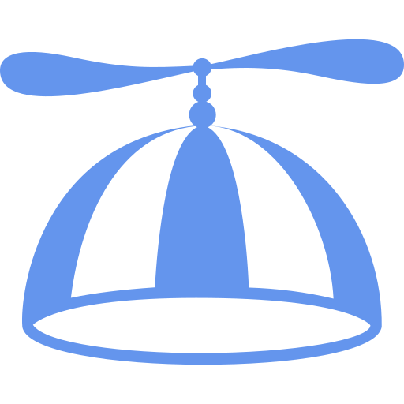

# a flying hat

<p align="center">
    
</p>

A Web App template leveraging [axum](https://github.com/tokio-rs/axum), [Askama](https://github.com/djc/askama), [htmx](https://github.com/bigskysoftware/htmx) and [Tailwind](https://github.com/tailwindlabs/tailwindcss).
Deployed with [Fly.io](fly.io).

## Setup

### Tailwind (standalone CLI)

Get the [latest release](https://github.com/tailwindlabs/tailwindcss/releases/latest) and give it executable permissions:

```no_rust
# Example for linux
curl -LO https://github.com/tailwindlabs/tailwindcss/releases/latest/download/tailwindcss-linux-x64
chmod +x tailwindcss-linux-x64
mv tailwindcss-linux-x64 tailwindcss
```

The `tailwind.config.js` file can be generated by running:

```no_rust
./tailwindcss init
```

### htmx

Simply copy htmx into your project.

Get the file from [unpkg.com](https://unpkg.com/htmx.org/dist/htmx.min.js)

Or simply run:

```no_rust
curl -L https://unpkg.com/htmx.org/dist/htmx.min.js -o htmx.min.js
```

### Fly.io

For a good overview you can check the [Speedrun](https://fly.io/docs/speedrun/) section of the official documentation.

### Dockerfile

Here's a repository with a very good example how to configure the Dockerfile: [letsgetrusty](https://github.com/letsgetrusty/api-deployment-example)

### cargo-watch

Make sure you have `cargo-watch` [installed](https://github.com/watchexec/cargo-watch#install):

```no_rust
# For Arch Linux
sudo pacman -S cargo-watch
```

### cargo-make

Make sure you have `cargo-make` [installed](https://github.com/sagiegurari/cargo-make#installation):

```no_rust
# For Arch Linux
sudo pacman -S cargo-make
```

## Available tasks:

**Remove old public directory if any, create a new one, populate it with assets files:**

```no_rust
cargo make build-public
```

**Clean, Format and Run project with cargo watch:**

```no_rust
cargo make run-dev
```

**Clean, Format and Build project for release:**

```no_rust
cargo make run-release
```
